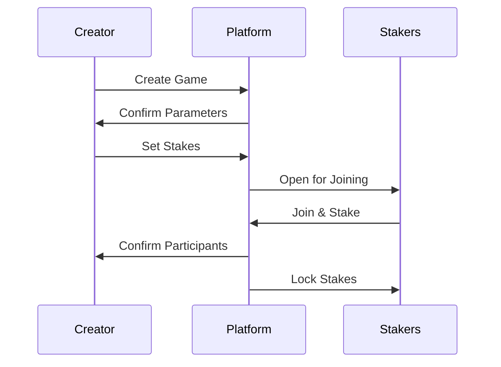
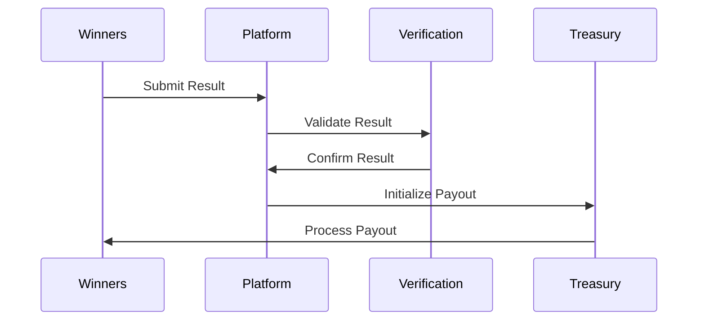
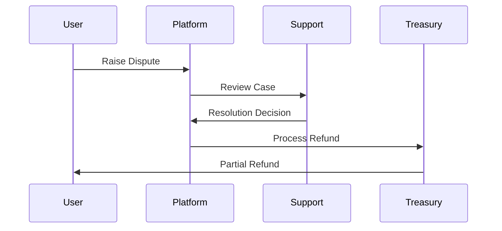
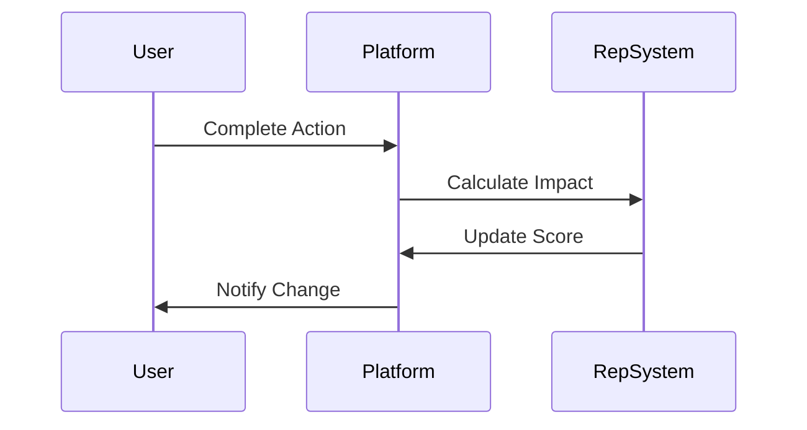

# Gambl - Product Requirements Specification

## 1. Introduction

### 1.1 Purpose
Gambl is a P2P betting platform enabling users to bet on any verifiable outcome, including sports, news events, custom scenarios, and eSports, with both individual and team betting capabilities.

### 1.2 Product Overview
A decentralized betting facilitator that allows users to create, join, and stake on games while ensuring fair play through reputation systems and automated payouts.

### 1.3 Target Users
- Individual bettors
- Team players/captains
- eSports enthusiasts
- External spectators/stakers
- Event creators
- Administrators

## 2. Product Features

### 2.1 Core Functionality

#### 2.1.1 Game Creation
- Create custom games with definable parameters
- Set stake requirements
- Define deadlines
- Specify verification requirements
- Set team size limits (for team games)

#### 2.1.2 Betting System
- Individual betting
- Team-based betting
- External spectator betting
- Pool-based stake distribution
- Multiple currency support (crypto/fiat)

#### 2.1.3 Result Verification
- Majority consensus requirement
- Multi-party verification
- Proof submission (images, videos, links)
- Automated result validation for public events

### 2.2 User Types & Permissions

#### 2.2.1 Regular Users
- Create/join games
- Place stakes
- Submit results
- Participate in verifications

#### 2.2.2 Administrators
- Support admin
- Admin
- Super admin
- Specialized permissions (TBD)

### 2.3 Game Types

#### 2.3.1 Public Events
- Sports matches
- News events
- Verifiable public occurrences

#### 2.3.2 Custom Events
- User-created competitions
- Team-based games
- Individual challenges

#### 2.3.3 eSports Integration
- Live game betting
- External spectator participation
- Early-game staking cutoff
- Pool-based reward distribution

### 2.4 Financial System

#### 2.4.1 Treasury Management
- Zero-hold policy except during active bets
- House-managed treasury
- Multiple currency support
- Instant/batch conversion capabilities

#### 2.4.2 Payment Processing
- 5-minute retry intervals
- 5 retry attempts before manual intervention
- Automated payout system
- Multiple payout methods

### 2.5 Security & Trust

#### 2.5.1 Reputation System
- Scalable point system (initial 1-15 scale)
- Tier-based privileges
- Reputation factors:
  - Game completion history
  - Dispute involvement
  - User reports
  - Support flags

#### 2.5.2 Verification Requirements
- Multi-factor for high-stakes
- Proof requirements based on reputation
- Result consensus mechanism

## 3. Process Flows

### 3.1 Game Creation & Staking

### 3.2 Result Verification & Payout

### 3.3 Dispute Resolution

### 3.4 Reputation Updates

## 4. Constraints & Future Scope

### 4.1 Current Limitations
- Manual intervention for specific disputes
- Fixed retry intervals for failed transactions
- Basic treasury management

### 4.2 Future Features
- DAO for dispute resolution
- Advanced treasury management
- KYC integration
- Rate limiting
- Automated risk management

### 4.3 Compliance Requirements
- Global operation with regional compliance
- Dispute resolution system
- Risk management protocols

## 5. Risk Assessment
[To be detailed based on specific regional requirements and operational risks]

## 6. Market Analysis
[To be updated with competitor analysis and market positioning]

## 7. Technical Requirements
[To be detailed in separate technical specification documents]